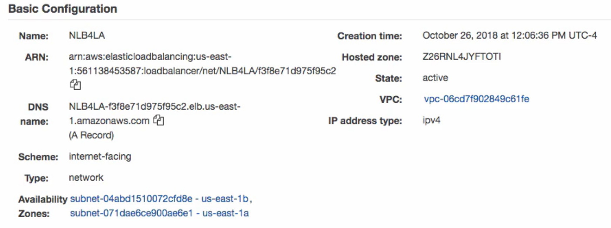

# terraform-aws-nlb-custom

This tf infra  module is used to deploy Network Load Balancer to AWS public cloud


|IaaC  |	cloud provider |	function	| full name  |
|:-----------:|:-----------:|:-----------:|:------------------------:|
|terraform |   aws |	network load balancer|	terraform-aws-nlb-custom   |


## Required inputs: 
These variables should be a deliberate choice. The module will fail if they are not defined. Only set defaults for variables that should have them. For example var.vpc_id should never have a default because the value would be different every time you use the module.
* **NLB Name** \<*string*>
* **NLB Scheme**: either *"internet-facing"* or *"internal"*
* At least one **Listener** with **LoadBalancerProtocol** (*TCP | UPD*) and  at least one **LoadBalancerPort** (*port number*, integer e.g. *443, 80* etc)
* **VPC id** (vpc-########) 
* **Subnet Id(s)** in the VPC indicate above (e.g. First SubnetId in us-east-1a, another SubnetIdin us-east-1b, and third in us-east-1c this giving you resilience in case of single AZ failure). 1 Subnet per 1 AZ is allowed.
* **TargetGroup** with Name, Protocol/Port and type (Instance or <tba>), 
* **HealthCheck Protocol** 
<br>*and optional
advanced healthcheck settings*:
- ***HealthChek Port***: (trafic | override)
- ***Healthy threshold***:(Integer number, default:3)
- ***Unhealthy threshhold***: (Integer number, default:3)
- ***HealthCheck Timeout***: (Intger, number of seconds, default:10)
- ***Healthcheck Interval***: ( either 10 or 30 secs, Default: 30sec)
<br>

* **RegisteredTargets** - InstanceID(s)
*


## Optional inputs: 
These should have a sensible default that will be acceptable in most use cases but may need adjusting. Advertise the default value. For example var.elb_idle_timeout will have a sensible default, but there is a chance that someone may need to modify it.

## Outputs: 
List all the outputs of your module and wrap the important and informational ones in user-friendly output templates.

* **ARN** of newly created NLB
* **DNS Name** of NLB Virtual IP address (A record)



Pre-requisites:


## Usage example to create NLB instance in us-west-1 region:
```
{
 module "nlb" {
  source  = "./terraform-modules/terraform-aws-nlb-custom"
  version = "1.0"
  
  # mandatory inputs
  
  name = var.nlb_name
  internal = var.nlb_internal # true = internal nlb, false = internet-facing nlb
  listeners = var.nlb_listeners # should include at least one LoadBalancerProtocol (TCP | UPD) and  at least one LoadBalancerPort (port number, integer e.g. 443, 80 
  vpc_id = var.nlb_vpcid
  subnet_ids = var.nlb_subnet_ids
  target_group = var.nlb_target_group #  TargetGroup with Name, Protocol/Port and type (Instance or <tba>)
  healt_chek_protocol = var.nlb_healthcheck_protocol
  
  # optional advanced healthcheck parameters
  health_check_port = var.nlb_healthcheck_port 
  health_check_healty_threshold = var.nlb_health_check_healty_threshold
  health_check_unhealty_threshold = var.nlb_health_check_unhealty_threshold
  health_check_timeout = var.nlb_health_check_timeout
  health_check_interval = var.nlb_health_check_interval 
  
  # mandatory inputs (cont.)
  registered_targets = var.nlb_registered_targets
  tags = var.nlb_tags
}
```

## Input Variables

<tba>

## Outputs 

<tba>

## Deafult values

<tba>

## hardcoded stuff
